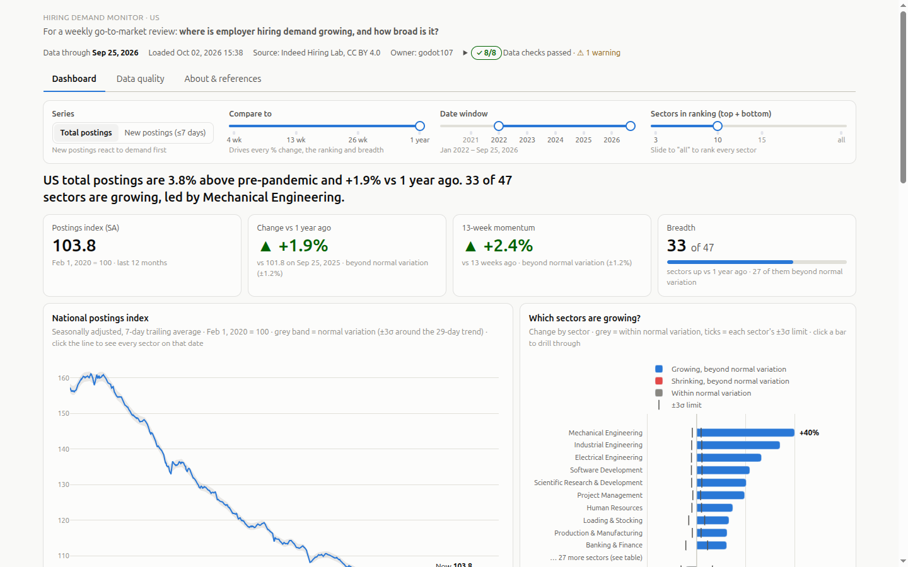
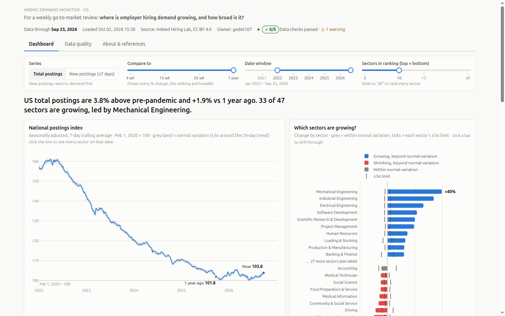
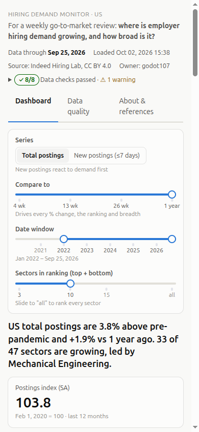
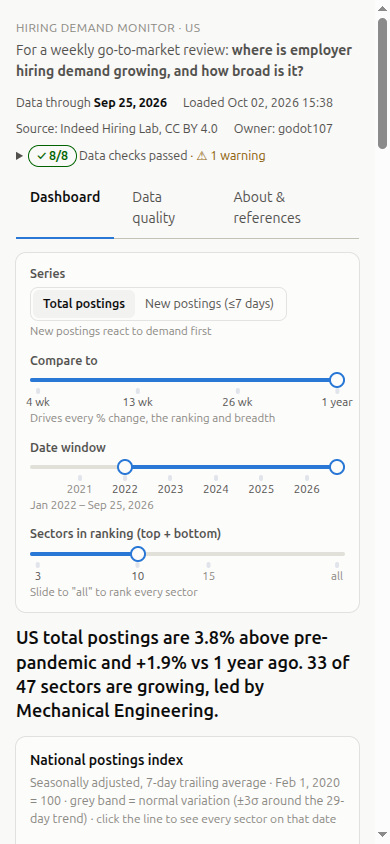

# exp001 variants: what each visitor sees

Reference for [`experiment_design.md`](experiment_design.md). Screenshots are
the first screen a visitor sees (no scrolling), taken from the running
monitor with each arm forced by a visitor id that hashes to it. Captured
2026-10-02 on data through Sep 25, 2026.

| | Order of the dashboard page |
|---|---|
| **A, control: tiles first** | Headline · KPI tiles · trend chart + sector ranking · the rest |
| **B, treatment: charts first** | Headline · trend chart + sector ranking · KPI tiles · the rest |

Same components, data, styling and callbacks. Only the two blocks swap.

## Desktop (1440 × 900)

| A: tiles first | B: charts first |
|---|---|
|  |  |

In A the tiles sit at the top of the content and the charts start about
560 px down, so the top of both charts is visible. In B the charts start at
about 420 px and fill the rest of the screen; the tiles move to about 1,000 px,
below the first screen.

## Mobile (390 × 844)

| A: tiles first | B: charts first |
|---|---|
|  |  |

On a phone the filter panel stacks vertically and pushes everything down. In
A the first tile starts near the bottom of the screen (about 740 px); in B the
trend chart's title is just visible (about 840 px). **So on mobile the two
first screens look almost the same**, and the difference only appears after
scrolling. Expect a smaller effect on phones than on desktops. Results by
device are exploratory (section 7 of the design), never the decision.

## How "better" is decided

The design fixes this in advance, so the answer can't be chosen after seeing
the data. In order:

1. **Check the split first (sample ratio).** Exposures should be about 50/50.
   If the chi-square p-value is below 0.001, assignment or logging is broken.
   Stop: no metric is read.
2. **The one decision metric: drill-through rate.** The share of exposed
   visitors who opened at least one drill-through (clicked a ranking bar, trend
   point, small multiple, table row or earnings bar to see the rows behind it).
   It measures whether the page makes people ask a second question.
   - **B is better** if its rate is higher and the difference is significant
     at 5% (the 95% interval for B minus A stays above zero).
   - **A is better** if B's rate is significantly lower.
   - **Otherwise it's inconclusive.** That isn't a tie, and A stays as the
     default. The readout states the smallest lift the sample could have
     detected.
3. **Supporting numbers, which never decide:** repeat drill-throughs, time to
   the first drill-through, which chart people drilled from first, returning
   visitors and device mix. They help explain a result and suggest the next
   test.

`analysis/report.py` computes steps 1 and 2. `analysis/brief.py` writes them up
for stakeholders, and shows no A-vs-B numbers until the stopping rule
(250 visitors per arm, or 28 days) is met.

### What this build doesn't measure

"More drill-throughs" is a fair definition of better only if B isn't also worse
in a way nobody is tracking. Three checks would close that gap, and the design
records that none of them is built yet:

| Guardrail | Why it matters | What it needs |
|---|---|---|
| Page load (LCP, 75th percentile) | A layout that wins clicks but loads slower isn't a win | A small browser beacon reporting load timing |
| JavaScript errors per visitor | A broken page can change click rates either way | The same beacon catching `window.onerror` |
| Quick exits (left within ~10 s with no interaction) | Charts-first might drive away visitors who only wanted a number | An "engaged" event sent after ~10 s on the page |

All three must be added **before** real traffic starts, never during the test.
