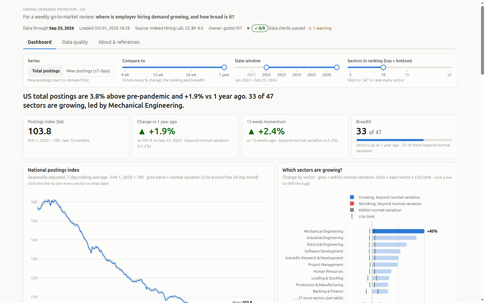
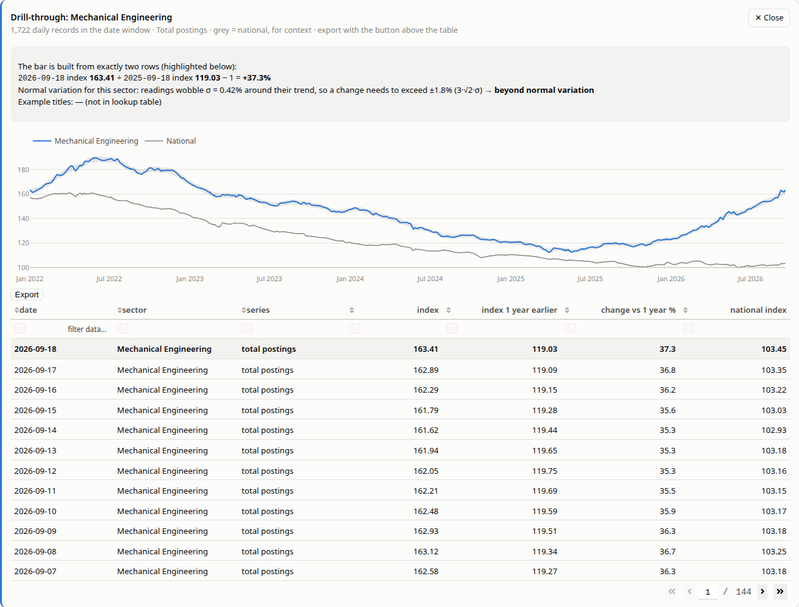
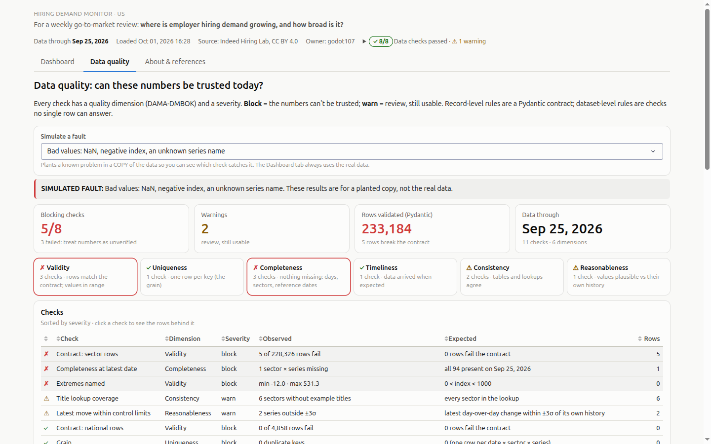
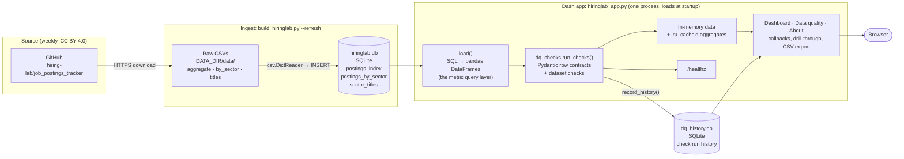

# Hiring Demand Monitor

[](https://github.com/godot107/ab-lab/actions/workflows/monitor.yml)

An interactive dashboard and data-quality suite built on **Indeed Hiring Lab's public Job Postings
Index**. It answers one question for a weekly go-to-market review:

> **Where is employer hiring demand growing, and how broad is it?**

Built with Plotly Dash, pandas, Pydantic and SQL. Every design choice maps to a named principle from
the data-visualization literature (Tufte, Knaflic, Cairo), every number traces back to the rows it
came from, and the data is checked before anything renders.



> Not affiliated with or endorsed by Indeed or Recruit Holdings. All data is public; see
> [Data & attribution](#data--attribution).

**Highlights**
- **Honest about uncertainty.** Each series gets a ±3σ normal-variation limit, and only moves beyond
  it get color, so a +0.7% change doesn't look as confident as a +37% one.
- **Drill-through on every mark,** down to the two records behind a number, with the arithmetic shown.
- **A data-quality tab** with Pydantic row contracts, dataset checks tagged by quality dimension and
  severity, a control chart, and a fault simulator that proves each check catches what it claims to.
- **Connected to the business.** Recruit Holdings defines US ARPJ (revenue per job posting) with this
  index as the denominator, and the earnings panel reconciles the two quarter by quarter.
- **Engineered like production:** 27 tests (including SQL-vs-pandas reconciliation), CI, a Docker
  image, and a one-command EC2 deploy with automatic HTTPS and a daily data refresh.

---

## What's in it

**Dashboard tab**
- **Filters in one row** that scope everything: series (total / new postings), compare-to period
  (4 / 13 / 26 weeks, 1 year), date window, and top/bottom-N sectors.
- **A computed takeaway title,** and KPI tiles where every number has a comparison.
- **Sector ranking** that's grey unless a move is beyond its ±3σ limit, with each limit drawn as ticks.
- **Small multiples on a shared scale.** The independent-scale option is labeled, with a warning.
- **Drill-through:** click a bar, panel, table row, trend point or earnings bar to see the underlying
  records.
- **Earnings context:** index YoY by Recruit fiscal quarter next to Recruit's reported figures.
- Light and dark themes, a phone layout, and CSV export on every table.



**Data quality tab**
- A **Pydantic contract** for every row: types, allowed values, bounds, no NaN. All ~232K rows are
  validated in about 0.4s, and failures come back with the exact row and field.
- **Dataset checks** no single row can answer: grain, freshness, completeness, continuity, reference
  dates, table alignment, lookup coverage.
- Each check has a **DAMA-DMBOK quality dimension** and a **severity:** `block` means the numbers can't
  be trusted; `warn` means review, still usable.
- An **individuals / moving-range control chart,** run history, and a **fault simulator** (duplicate
  load, stale pipeline, sector drop-out, missing day, bad values, spike).



**About & references tab:** a glossary, the earnings-link reasoning step by step, methods,
limitations, and every source link.

---

## Quick start

```bash
python -m venv .venv && source .venv/bin/activate
pip install -r requirements-dev.txt

python app/build_hiringlab.py --refresh    # download Hiring Lab data → app/var/hiringlab.db
python app/hiringlab_app.py                # http://127.0.0.1:8050   (add --dev for hot reload)
python -m pytest                           # 27 tests, synthetic data, no network

python app/hiringlab_dashboard.py          # optional: static single-file HTML → app/var/
python app/dq_checks.py --fault spike      # run the checks against a planted fault
```

Or with Docker (the container downloads the data on first start):

```bash
docker build -t hiring-monitor-web app
docker run -p 8050:8050 -v hm_data:/data hiring-monitor-web
```

> **pandas 3.0.4** segfaults on datetime filtering with numpy 2.4. Use 3.0.6 or later.

## Architecture

How the data gets from Indeed's repo to a chart. It's a batch pipeline with one store: SQLite
on disk, which is loaded into pandas once at startup and then served from memory.



| Stage | Where | Notes |
|---|---|---|
| Source | [hiring-lab/job_postings_tracker](https://github.com/hiring-lab/job_postings_tracker) | Indeed publishes weekly. Only the three US files are pulled. |
| Raw CSVs | `DATA_DIR/data/` | Kept as downloaded, so a load can be replayed without the network. |
| Database | `DATA_DIR/hiringlab.db` (SQLite) | Dropped and rebuilt on every run, so a load is idempotent. The composite primary keys enforce the grain (date × sector × `variable`). |
| Load | `hiringlab_dashboard.load()` | Metric logic lives in this query layer, not in the charts. `tests/test_sql_parity.py` checks it against `sql/`. |
| Validate | `dq_checks.py` | Runs before anything renders. Results go on the page, feed `/healthz`, and are appended to `dq_history.db`, a separate file so rebuilds don't wipe it. |
| Serve | `hiringlab_app.py` | Data is held in memory (~220 MB per worker). New data needs a restart. |

**Refresh.** Locally, re-run `build_hiringlab.py --refresh` and restart the app. In production, a
systemd timer runs the same command inside the `web` container at 13:00 UTC daily, then restarts
it. If the timer ever stops, the Freshness check turns the dashboard badge red.

**Production path.** Browser → Caddy (automatic HTTPS, ports 80/443) → gunicorn `web` container
(port 8050) on EC2. `DATA_DIR` is the `hm_data` Docker volume, so the data and check history survive
image rebuilds. On an empty volume, `entrypoint.sh` downloads the data on first start.

## Repository layout

| Path | What it does |
|---|---|
| `app/hiringlab_app.py` | The Dash app: Dashboard, Data quality and About tabs; `/healthz`; WSGI `server` |
| `app/dq_checks.py` | Pydantic contracts, dataset checks, control limits, fault injection, run history |
| `app/dq_page.py` | Layout and callbacks for the Data quality tab |
| `app/hiringlab_dashboard.py` | Static single-file HTML build; shared design tokens and CSS |
| `app/references.py` | Glossary, methods, limitations and source links |
| `app/build_hiringlab.py` | Downloads the Hiring Lab CSVs and loads SQLite |
| `sql/` | The core metrics in SQL (sector change, fiscal-quarter YoY, grain check) |
| `tests/` | pytest suite on synthetic data, including SQL-vs-pandas parity |
| `infra/ec2.yaml` | CloudFormation: EC2 (arm64), security group, Elastic IP, bootstrap |
| `deploy/` | Numbered deploy scripts: key pair → stack → push → verify → teardown |
| `compose.yaml` | Production stack: `web` (gunicorn) + `caddy` (automatic HTTPS) |

---

## Design principles, and where they show up

| Principle | Where | Source |
|---|---|---|
| Design to one audience and one decision | Purpose line at the top | Knaflic, *Storytelling with Data* ch. 1 |
| The title is the takeaway | Computed headline | Knaflic (vertical logic) |
| Every number has a comparison | Baselines, year-ago values, Recruit figures | Tufte's "Compared to what?", via Cairo |
| Show uncertainty; color only what's unusual | ±3σ bands, grey-unless-beyond ranking | Cairo, *The Truthful Art* ch. 11; Knaflic ch. 4 |
| Chart chosen by the comparison; one axis | Sorted zero-baseline bars; no dual axis | Knaflic ch. 2; Tufte |
| Small multiples on a shared scale | Multiples panel + labeled toggle | Tufte, *VDQI* ch. 8 |
| Overview first, details on demand | Tiles → charts → drill-through | Shneiderman |
| Document everything / thresholds as controls | Check badge, definitions, DQ tab | Tufte; Sebastian-Coleman, *Measuring Data Quality* |

## Why the earnings link holds

1. **Recruit defines the KPI with this index.** "US ARPJ … is calculated by dividing HR Technology
   revenue in the US by the total number of US job postings on Indeed. … The denominator … is measured
   by the Indeed Hiring Lab US Job Postings Index." (Q1 FY2026 call)
2. **An index's growth equals the count's growth.** With I_t = 100·N_t/N_0, the ratio I_t/I_s = N_t/N_s,
   because the base cancels. The index gives postings growth exactly, but never the level.
3. **It's an identity, not a correlation.** Revenue = Postings × ARPJ, so
   (1 + g_revenue) = (1 + g_postings)(1 + g_ARPJ). Q1 FY2026: 0.96 × 1.35 − 1 = +29.6%, vs +30.0%
   reported. `tests/test_metrics.py` checks every disclosed quarter.
4. **The index is not a revenue proxy.** Indeed bills per interaction (per click or per started
   application), so pricing, clicks and Premium all live in ARPJ, which the index can't see.

## Method notes

- **Index.** Seasonally adjusted, 7-day trailing average, each series indexed to 100 on **its own**
  Feb 1, 2020 level. Compare growth across sectors, not size. The finest grain is date × sector × series.
- **Normal variation.** σ = std of each series' readings around its centered 29-day trend (last 3 years).
  A change between two readings is *beyond normal variation* if |change| > 3·√2·σ. A screening rule,
  not a significance test: the series is smoothed and autocorrelated.
- **Control check.** The latest day-over-day change vs ±3σ of the series' own day-over-day changes.

| Check | Dimension | Severity | Catches |
|---|---|---|---|
| Contract: sector / national rows (Pydantic) | Validity | block | wrong types, unknown series, NaN, out-of-range |
| Grain | Uniqueness | block | duplicate loads, double-counting joins |
| Freshness (≤ 14 days) | Timeliness | block | a stuck pipeline |
| Completeness at latest date | Completeness | block | a sector silently dropping out |
| Continuity | Completeness | block | missing days |
| Comparison dates | Completeness | block | % changes computed against the wrong day |
| Extremes named | Validity | block | impossible values; names real extremes rather than hiding them |
| Tables aligned | Consistency | warn | national and sector tables on different days |
| Title lookup coverage | Consistency | warn | reference-data gaps (degrades a label, not a number) |
| Latest move within control limits | Reasonableness | warn | special-cause spikes: real news or a bad load |

## Testing

`python -m pytest` runs 27 tests on a synthetic dataset with the production schema. No network needed:

- **Every planted fault is caught by its intended check,** and clean data passes.
- **Pydantic reports the exact row and field** of each bad value.
- **The index math:** growth doesn't depend on the base, and revenue = postings × ARPJ matches Recruit.
- **SQL and pandas agree** to floating-point precision (`sql/` vs the app's metrics).
- **A smoke test** starts the app and hits `/` and `/healthz`.

CI runs the tests, `cfn-lint`, ShellCheck and a Docker build on every push.

---

## Deploy to AWS EC2

The same pattern as a Flask app I've deployed before: Docker Compose with gunicorn and Caddy
(automatic Let's Encrypt HTTPS), infrastructure in CloudFormation, and scripts that verify the live
site.

```bash
cp deploy/config.env.example deploy/config.env   # domain, email, region, your IP for SSH
./deploy/01_keypair.sh      # EC2 key pair → ~/.ssh
./deploy/02_stack.sh        # CloudFormation: instance + Elastic IP; prints the DNS record to add
# add the A record (the script prints the Lightsail DNS command), wait for it to resolve
./deploy/03_push_app.sh     # rsync the app, build, start (first start downloads the data)
./deploy/04_verify.sh       # DNS, HTTPS redirect, certificate, /healthz, data freshness, refresh timer
./deploy/99_teardown.sh     # delete everything and prove nothing billable is left
```

What the instance runs: Ubuntu 24.04 on Graviton (arm64), an encrypted gp3 root volume, IMDSv2 only,
SSH limited to your IP, a systemd unit for `docker compose up`, and a **daily timer** that refreshes the
data and restarts the app. `/healthz` reports `data_through` and whether blocking checks pass.

**Approximate cost (us-east-1, 730 h/month)**

| Item | t4g.small (2 GB, recommended) | t4g.micro (1 GB) |
|---|---|---|
| Instance ($0.0168 / $0.0084 per hour) | $12.26 | $6.13 |
| Public IPv4 / Elastic IP ($0.005 per hour) | $3.65 | $3.65 |
| 20 GB gp3 ($0.08 per GB-month) | $1.60 | $1.60 |
| **Total** | **≈ $17.51 / month** | **≈ $11.38 / month** |

The app uses ~185 MB of memory in its container, so a t4g.micro works with `WEB_WORKERS=1`. New
accounts get 750 free hours of public IPv4 a month for 12 months. Prices from AWS's EC2, VPC and EBS
pricing pages (Sep 2026); check the AWS Pricing Calculator for your region.

## Limitations

- **Postings are demand signals,** not hires, employment or revenue. Openings can fall because
  positions were filled.
- **Postings on Indeed,** not the whole labor market. Platform changes (for example, free-posting
  limits) can move the index independently of hiring demand.
- **Index, not counts.** Rankings show direction, not where most jobs are.
- Hiring Lab revised its seasonal-adjustment method in Nov 2024 and restated history.

## Data & attribution

- **Indeed Hiring Lab Job Postings Index**, [github.com/hiring-lab/job_postings_tracker](https://github.com/hiring-lab/job_postings_tracker),
  licensed [CC BY 4.0](https://creativecommons.org/licenses/by/4.0/). Source: Indeed Hiring Lab. The CSVs
  aren't committed; `build_hiringlab.py --refresh` downloads them.
- **Recruit Holdings earnings-call transcripts** (figures in the earnings panel, as stated on each call):
  [Q2 FY2025](https://recruit-holdings.com/en/ir/library/upload/recruit_202603Q2_call-transcript_en/) ·
  [Q3 FY2025](https://file.recruit-holdings.com/files/en/Recruit_202603Q3_call-transcript_en.pdf) ·
  [Q4 FY2025](https://file.recruit-holdings.com/files/en/Recruit_202603Q4_call-transcript_en.pdf) ·
  [Q1 FY2026](https://file.recruit-holdings.com/files/en/Recruit_202703Q1_call-transcript_en.pdf)
- **Indeed, [How pricing works on Indeed](https://www.indeed.com/hire/resources/howtohub/how-pricing-works-on-indeed)**
  (updated Aug 2026).

## Roadmap

- Label key events on the trend (2020 shutdowns, 2022 peak, Nov 2024 methodology revision)
- A full-history context strip under the windowed trend
- "Consistent risers": sectors beyond normal variation in both the 13-week and 1-year windows
- "You-are-here" drill chart and a slopegraph view
- Metro / state breakdowns from Hiring Lab's geographic files
- Replace `dash_table` with dash-ag-grid (Dash 4 marks `dash_table` for future removal)

## How this was built

Designed and written with an AI coding assistant (Claude Code) in the loop, the same way I work day to
day: I set the questions, the design principles and the checks, and I reviewed and tested what it
produced. The tests, the data-quality checks and the reconciliation against Recruit's disclosures are
how the numbers are held to account, whoever wrote the code.

## License

Code: [MIT](LICENSE). Data: © Indeed Hiring Lab, [CC BY 4.0](https://creativecommons.org/licenses/by/4.0/).
